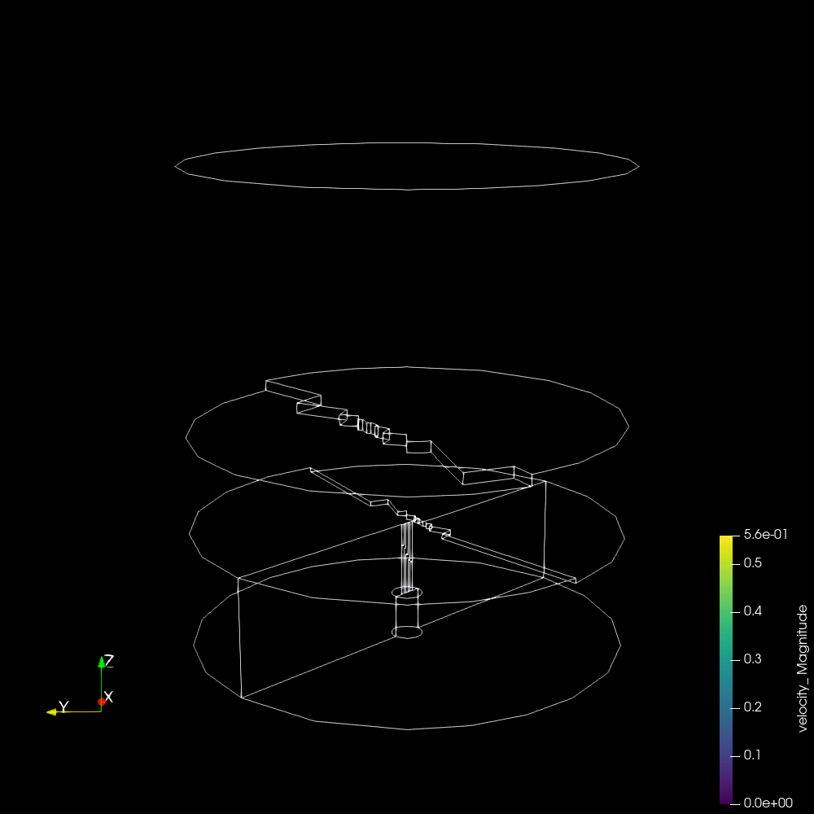
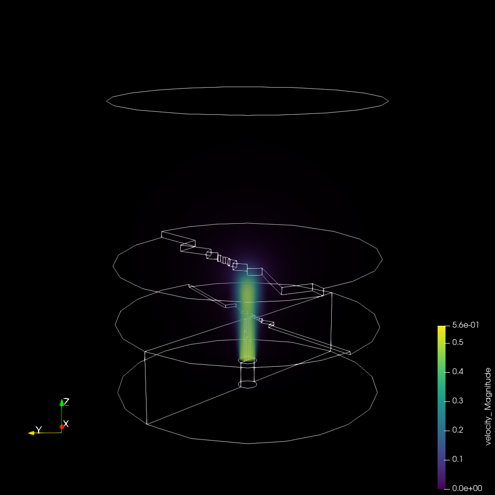
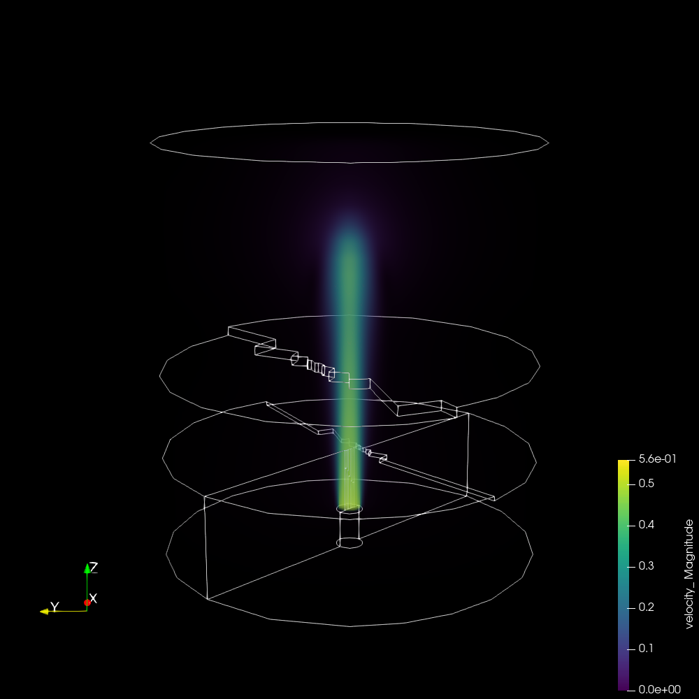

# ExaWind-NaluWind workflow with post-processing

    

Diagram of the workflow in this example.

A repository for examples using `ExaWind-NaluWind` and `ParaView` for creation of `Cinema` databases.

ExaWind-NaluWind build instructions for Spack can be found [here](https://nalu-wind.readthedocs.io/en/latest/source/user/build_spack.html). The Spack environment in this repo matches the ExaWind-NaluWind install available in the E4S cache.

The embedded example run is derived from a regression test, and can be found in the ExaWind-NaluWind source [here](https://github.com/Exawind/nalu-wind/tree/88342423d9ba3b22f33887357876bc4f05fefc3d/reg_tests/test_files/nonIsoEdgeOpenJet). Small tweaks were made to make the simulation run through more timesteps.

<table>
<tr>
<td>
<td>
<td>
</tr>
</table>

Images from the resulting Cinema database (used to validate run)

The workflow does the following:

- Creates a [Pantheon](http://pantheonscience.org/) environment and build location
- Clones a specific commit of [Spack](https://github.com/spack/spack)
- Uses `spack` to build [ExaWind-NaluWind](https://nalu-wind.readthedocs.io/en/latest/)
- Runs a regression test, which produces output readable by [ParaView](https://paraview.org)
- Runs a `ParaView` (`pvpython`) script to produce a `Cinema` database
- Installs a `Cinema` viewer, then packages up the results
- Validates the `Cinema` database

## Using this repository

First, clone the repository, then:

- Edit the `bootstrap.env` file to include your compute allocation ID and the base path where installs and results should go.
- Execute the workflow by typing `./execute`. Take a look at this file to see the steps that are executed, and where to look for more detail.
